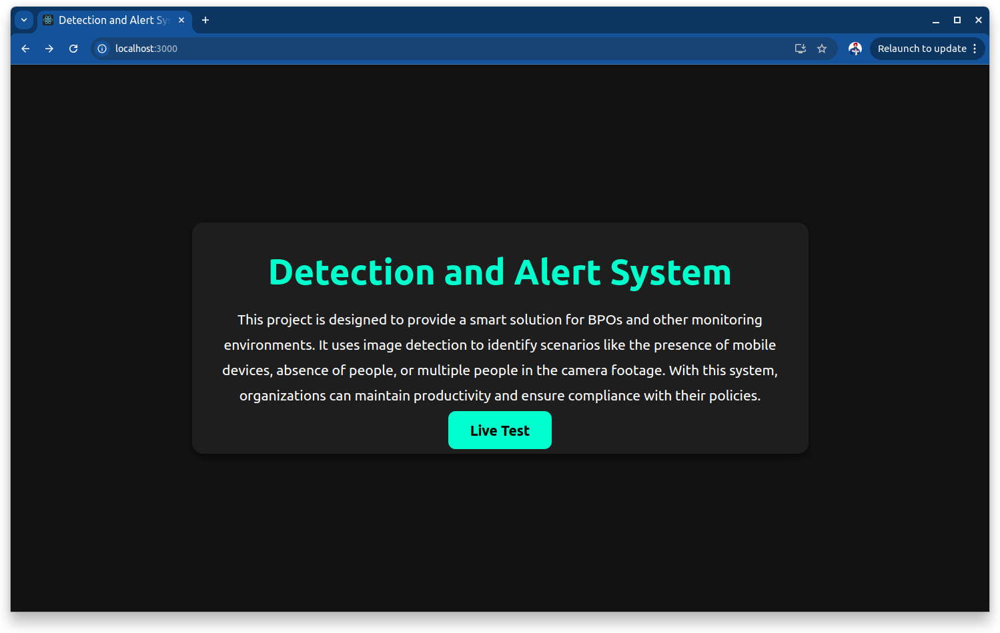
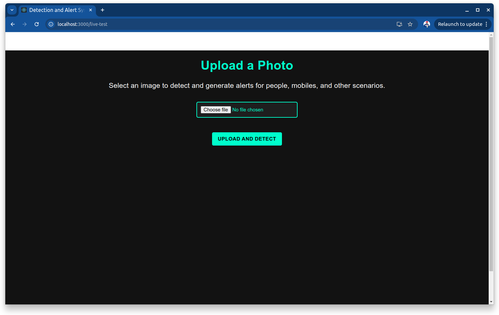
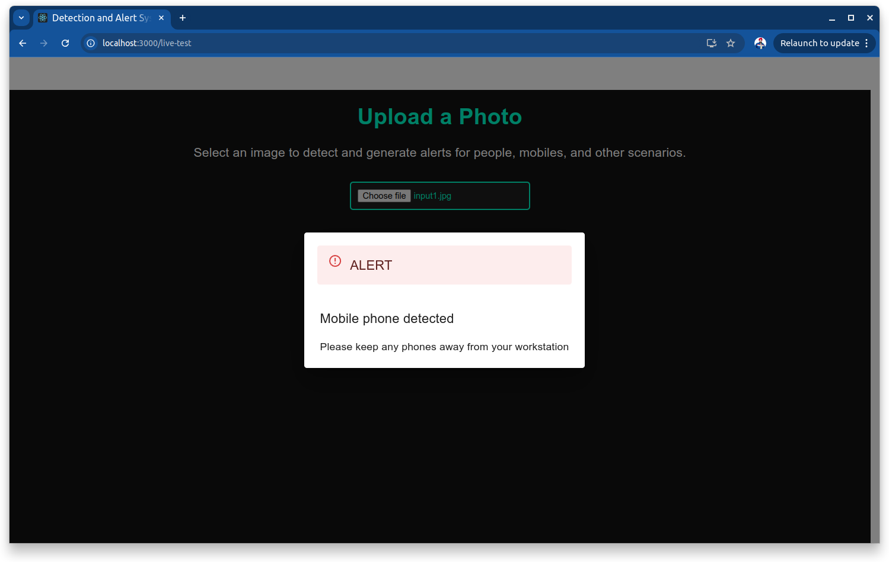
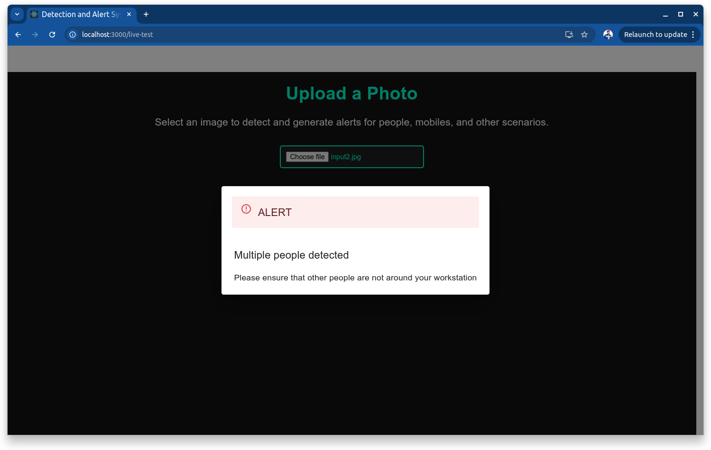
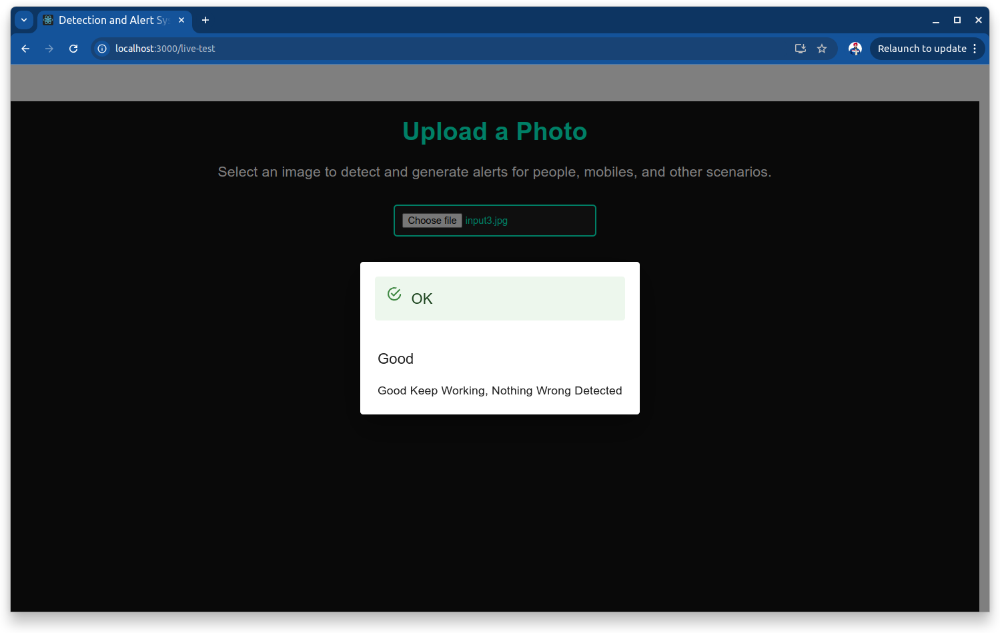

Here's a **README.md** template you can use for your project:

---

# **Detection and Alert System**

This project provides a smart solution for BPOs and monitoring environments by detecting scenarios like mobile usage, absence of people, or multiple people in camera footage. It generates alerts accordingly to help maintain productivity and compliance with organizational policies.

---

## **Features**
- Detects scenarios like:
  - Mobile phone usage.
  - No people in the frame.
  - Multiple people in the frame.
- Provides alerts such as **ALERT**, **WARN**, or **OK** with detailed messages.
- User-friendly interface to upload images and get detection results.

---

## **Screenshots**
_Add your images here:_
- Landing Page  
  
  
- Live Test Page  
  

- Input Image and Result 1  
    

- Input Image and Result 2
    

- Input Image and Result 3
    

---

## **Setup Instructions**

### **Backend Setup**
The backend is built with Python (Flask). Follow the steps below to set up the backend:

1. **Clone the repository**:
    ```bash
    git clone https://github.com/mpsingh47/detection-alert-system.git
    cd detection-alert-system/backend
    ```

2. **Create and activate a virtual environment**:
    ```bash
    python -m venv venv
    source venv/bin/activate  # For Linux/Mac
    venv\Scripts\activate     # For Windows
    ```

3. **Install dependencies**:
    ```bash
    pip install -r requirements.txt
    ```

4. **Run the backend server**:
    ```bash
    python main.py
    ```
   The backend server will be available at `http://127.0.0.1:5000`.

---

### **Frontend Setup**
The frontend is built with React. Follow the steps below to set up the frontend:

1. **Navigate to the frontend directory**:
    ```bash
    cd ../frontend
    ```

2. **Install dependencies**:
    ```bash
    npm install
    ```

3. **Run the frontend server**:
    ```bash
    npm start
    ```
   The frontend will be available at `http://localhost:3000`.

---

## **Usage**
1. Visit the landing page at `http://localhost:3000`.
2. Click on **Live Test** to navigate to the test page.
3. Upload an image to test the detection system.
4. View the generated alert and message based on the detection result.

<!-- --- -->

<!-- ## **Demo Video**
_Add a link to your demonstration video here if available:_
[Demo Video](path/to/demo-video.mp4) -->

---

## **Contributing**
Contributions are welcome! Please feel free to submit a pull request or raise an issue if you find bugs or want to suggest improvements.

---

## **License**
This project is licensed under the MIT License. See the [LICENSE](LICENSE) file for details.

---

Let me know if you need help adding images or videos! 😊